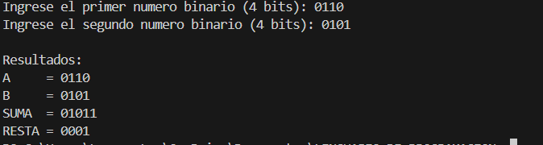
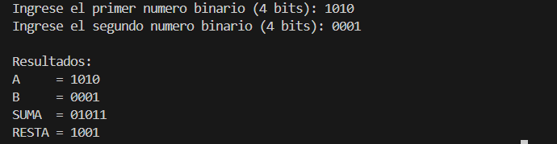
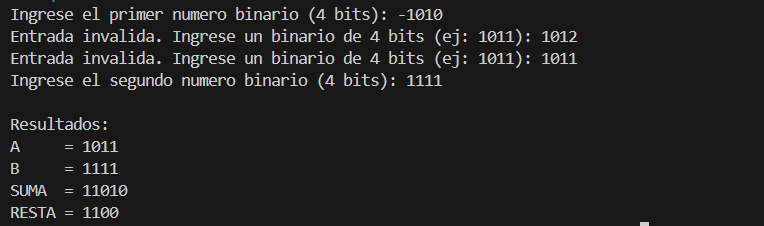

# Sumador-y-Restador-4-bits

-INTRODUCCION

En este proyecto se desarrolló un sumador y restador binario de 4 bits en Python, simulando el funcionamiento básico de la lógica digital. El programa utiliza únicamente compuertas lógicas AND, OR y NOT, sin apoyarse en operadores aritméticos propios del lenguaje.

La suma se implementa mediante sumadores completos, y la resta se realiza usando el método del complemento a dos. El objetivo principal es entender cómo operaciones básicas como sumar y restar pueden construirse a partir de compuertas lógicas, reforzando los conceptos vistos en clase sobre sistemas digitales.
El usuario ingresa los valores binarios por la terminal, y el sistema muestra en pantalla los resultados de la suma y la resta aplicando sumadores completos y complemento a dos.

-OBJETIVO

Implementar un sumador y un restador binario de 4 bits en Python utilizando únicamente compuertas lógicas AND, OR y NOT, con el fin de comprender el funcionamiento de las operaciones aritméticas a nivel de lógica digital.

-FUNCIONAMIENTO

El programa recibe dos numeros binarios de 4 bits ingresados por el usuario desde la terminal.

Primero se realiza la suma bit a bit utilizando sumadores completos y propagacion de carry.

Para la resta, el segundo numero se convierte a complemento a dos y luego se suma al primero.

-EJECUCION DEL PROGRAMA

Para ejecutar el programa desde la terminal, primero se debe abrir la terminal del sistema y acceder a la carpeta donde se encuentra el archivo del proyecto.

1.Ubicarse en la carpeta del proyecto usando el comando cd:

cd ruta/del/proyecto

2.Una vez dentro de la carpeta, ejecutar el archivo principal con Python 3:

python sumador_restador.py

-RESULTADOS

El programa genera resultados correctos para la suma y la resta de numeros binarios de 4 bits.
En la siguiente imagen se muestra un ejemplo de la ejecucion del programa desde la terminal.

Prueba 1

Prueba 2

Prueba 3

